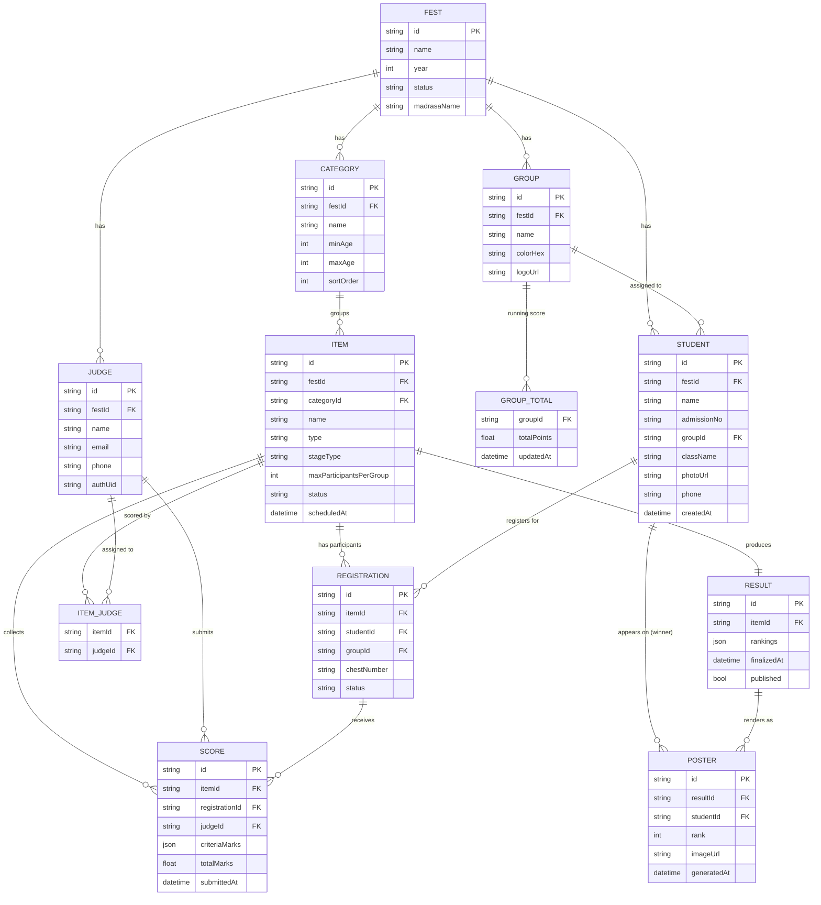

# Database Schema

The domain model is designed relationally first (so it's unambiguous), then mapped
onto Firestore collections (the chosen backend — see `ARCHITECTURE.md`). A
Postgres DDL is also given as a drop-in alternative if the project ever needs a
traditional SQL backend (e.g. a web admin dashboard reusing the same data).

## 1. Entity-Relationship Diagram



## 2. Field Notes

- **`FEST.madrasaName`** — set from Admin > Settings; shown on generated
  posters in place of the generic "MEELAD FEST" app branding, so a poster
  reflects the actual institution running the fest.
- **`STUDENT.groupId`** — every student belongs to exactly one of the fest's
  groups (typically 2, e.g. "Green Team" / "Golden Team", but any number is
  supported). Group is a first-class, admin-managed entity (name/color),
  created/renamed/deleted per fest like Category or Item, not a hardcoded
  enum.
- **`STUDENT.categoryId`** — which age Category (Sub-Junior, Junior, ...) the
  student competes in; Registrations only ever offer a category's own
  students for its items, so this must be set before a student can be
  registered for anything.
- **`ITEM.type`** — `individual` | `group` (some Meelad items, e.g. group
  songs/Mappila Paattu, register a *team* of students as one participant entry).
- **`ITEM.stageType`** — `stage` | `off-stage`, common Meelad-fest distinction
  affecting scheduling.
- **`ITEM.maxScore`** — what judges mark that item out of; configurable per
  item (e.g. 10 for a solo recitation, 20 for a group song) rather than a
  fest-wide constant, since items vary widely in scoring convention.
- **`REGISTRATION.chestNumber`** — printed on the student's chest number badge;
  unique per item, used by judges to identify participants without needing
  names (common competition practice, reduces bias).
- **`SCORE.totalMarks`** — a single judge's mark for one participant, out of
  that item's `maxScore`; averaged across all assigned judges' submissions to
  get the mark used for ranking and grading.
- **`RESULT.rankings`** — JSON array of
  `{ registrationId, rank, totalMarks, maxScore, grade, points }`, written
  once by the result-computation Cloud Function; `published` gates visibility
  on the public leaderboard (Admin can review before publishing). Every
  registrant gets an entry, not just the top 3 — grade doesn't depend on
  rank, so a 5th-place participant can still earn an A grade and its points.
- **`GROUP_TOTAL`** — one row per group, updated transactionally every time a
  `RESULT` is finalized; this is what the "overall grand total" screen reads —
  it is a materialized aggregate, not computed live from all results every time,
  so the leaderboard stays O(1) to read regardless of how many items have run.
- **Points are rank points + grade points, additive** — the common
  Kalolsavam-style fest convention. Rank points come from a rank → points
  table (1st = 5, 2nd = 3, 3rd = 1, else a flat participation point,
  configurable). Grade points come from a *separate* percentage-of-maxScore
  → grade table (A ≥ 90% = 5pts, B ≥ 75% = 3pts, C ≥ 60% = 1pt, configurable)
  applied to every participant regardless of rank. See
  `mobile/www/js/point-system.js` (client + Local Test Mode) and
  `functions/src/pointSystem.ts` (Cloud Function) — the two are kept in sync
  by hand since they can't share source.

## 3. Firestore Mapping

Firestore is document/collection based, so the relational model above maps to
**top-level collections scoped under a fest document**, using denormalized
IDs for relationships (no native joins):

```
fests/{festId}
  groups/{groupId}
  categories/{categoryId}
  students/{studentId}
  items/{itemId}                # assignedJudgeIds: [judgeId, ...] denormalized onto the doc
  results/{itemId}              # one result doc per item, doc ID == itemId
  groupTotals/{groupId}         # one doc per group, doc ID == groupId
  posters/{posterId}
  judges/{judgeId}

registrations/{registrationId}  # flat top-level, filtered by itemId field —
scores/{scoreId}                # simpler security rules (both are queried
                                 # across the whole app, not per-fest-scoped)
```

- Denormalize `groupName`, `groupColorHex`, `studentName`, `studentPhotoUrl`
  onto `registrations` documents at write time — the Judge Panel and public
  leaderboard read only from `registrations`/`results` and never need to
  fan-out fetch `students`/`groups` per row, keeping those real-time listeners
  cheap.
- Composite indexes needed: `registrations (itemId, groupId)`,
  `scores (itemId, judgeId)`, `students (festId, groupId)`,
  `items (festId, categoryId, status)`.

## 4. Equivalent Postgres DDL (optional SQL backend)

```sql
create table fests (
  id uuid primary key default gen_random_uuid(),
  name text not null,
  year int not null,
  status text not null default 'draft'
);

create table groups (
  id uuid primary key default gen_random_uuid(),
  fest_id uuid references fests(id) on delete cascade,
  name text not null,
  color_hex text,
  logo_url text
);

create table categories (
  id uuid primary key default gen_random_uuid(),
  fest_id uuid references fests(id) on delete cascade,
  name text not null,
  min_age int,
  max_age int,
  sort_order int default 0
);

create table students (
  id uuid primary key default gen_random_uuid(),
  fest_id uuid references fests(id) on delete cascade,
  name text not null,
  admission_no text,
  group_id uuid references groups(id),
  class_name text,
  photo_url text,
  phone text,
  created_at timestamptz default now()
);

create table items (
  id uuid primary key default gen_random_uuid(),
  fest_id uuid references fests(id) on delete cascade,
  category_id uuid references categories(id),
  name text not null,
  type text not null check (type in ('individual','group')),
  stage_type text check (stage_type in ('stage','off-stage')),
  max_participants_per_group int default 1,
  status text not null default 'pending' check (status in ('pending','ongoing','completed')),
  scheduled_at timestamptz
);

create table registrations (
  id uuid primary key default gen_random_uuid(),
  item_id uuid references items(id) on delete cascade,
  student_id uuid references students(id),
  group_id uuid references groups(id),
  chest_number text,
  status text default 'registered',
  unique (item_id, student_id)
);

create table judges (
  id uuid primary key default gen_random_uuid(),
  fest_id uuid references fests(id) on delete cascade,
  name text not null,
  email text unique,
  phone text,
  auth_uid text
);

create table item_judges (
  item_id uuid references items(id) on delete cascade,
  judge_id uuid references judges(id) on delete cascade,
  primary key (item_id, judge_id)
);

create table scores (
  id uuid primary key default gen_random_uuid(),
  item_id uuid references items(id) on delete cascade,
  registration_id uuid references registrations(id) on delete cascade,
  judge_id uuid references judges(id),
  criteria_marks jsonb not null,
  total_marks numeric not null,
  submitted_at timestamptz default now(),
  unique (registration_id, judge_id)
);

create table results (
  item_id uuid primary key references items(id) on delete cascade,
  rankings jsonb not null,
  finalized_at timestamptz,
  published boolean default false
);

create table group_totals (
  group_id uuid primary key references groups(id) on delete cascade,
  total_points numeric not null default 0,
  updated_at timestamptz default now()
);

create table posters (
  id uuid primary key default gen_random_uuid(),
  result_item_id uuid references results(item_id) on delete cascade,
  student_id uuid references students(id),
  rank int not null,
  image_url text,
  generated_at timestamptz default now()
);
```
