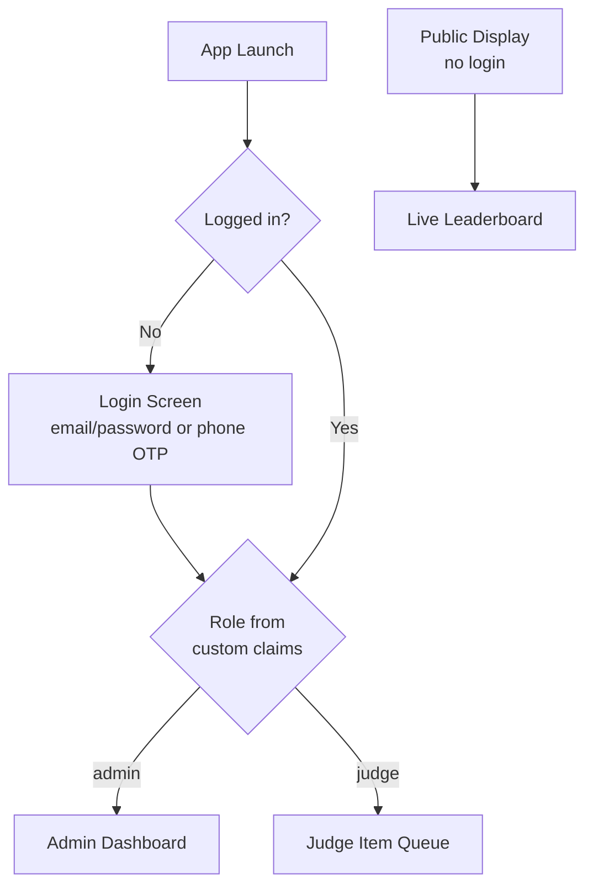
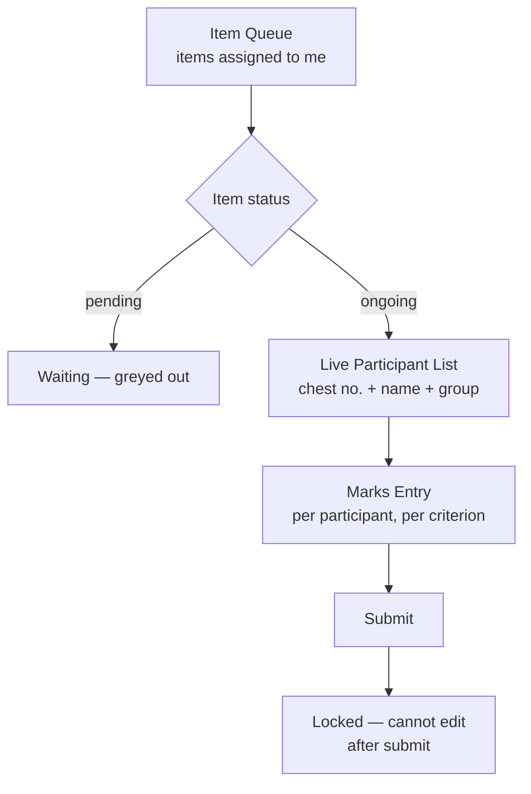
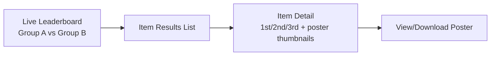

# UI / UX Workflow

## 1. Entry & Role Routing



A single app binary serves all three roles; `go_router` redirects post-login
based on the Firebase Auth custom claim `role`. The Public Display flow is
reachable without login via a "View Results" entry point on the login screen
(for parents/students), and separately as a dedicated kiosk build for a lobby
TV.

## 2. Admin Workflow

```mermaid
flowchart LR
    Dash[Dashboard<br/>fest status, quick stats] --> Students[Students]
    Dash --> Groups[Groups]
    Dash --> Categories[Categories]
    Dash --> Items[Items]
    Dash --> Reg[Registrations]
    Dash --> Judges[Judges]
    Dash --> Results[Results & Analytics]

    Students --> StudentForm[Add/Edit Student<br/>name, photo, class, group]
    Groups --> GroupForm[Edit Group<br/>name, color, logo]
    Categories --> CategoryForm[Add/Edit Category<br/>name, age range]
    Items --> ItemForm[Add/Edit Item<br/>name, category, type, stage]
    Reg --> RegForm[Register Student to Item<br/>pick category -> item -> student -> chest no.]
    Judges --> JudgeForm[Add Judge + Assign to Item(s)]
    Results --> ItemResult[Item Result: 1st/2nd/3rd]
    Results --> Leaderboard[Group A vs Group B totals]
    Results --> PosterGen[Generate Poster]
```

**Dashboard** — top of the admin app: fest name/year, counts (students, items,
completed vs pending), and a prominent live **Group A vs Group B** score bar
(same widget reused on the public leaderboard). Quick actions: "Add Student",
"Add Item", "Open Item for Scoring".

**Students screen** — searchable/filterable list (by group, class, category
eligibility), swipe-to-edit, bulk CSV import for large enrollments (a real pain
point at fest registration time), avatar photo capture via camera or gallery.

**Groups screen** — exactly 2 cards (fixed cardinality, but editable), each
showing name, color swatch, logo, and live student count / running score;
tapping edits name/color/logo only (groups aren't created/deleted, just the two
seeded at fest setup — this matches the "2 distinct Groups" requirement while
still being configurable, e.g. renaming "Team A" to "Green Brigade").

**Categories screen** — simple reorderable list (Sub-Junior, Junior, Senior,
Super Senior, ...), add/edit/delete, each with an age range used to filter
eligible students during registration.

**Items screen** — list grouped by category, each item shows status chip
(pending/ongoing/completed), tap to edit (name, category, individual vs group,
stage vs off-stage, max participants per group). A prominent **"Open for
Scoring"** toggle here is what flips `status -> ongoing` and pushes to judges.

**Registrations screen** — the core data-entry flow: pick a Category → pick an
Item within it → pick eligible Students (auto-filtered to the category's age
range, showing their Group) → assign chest numbers → save. Shows a running
count per group per item so admins can visually balance participation.

**Judges screen** — add judge (name/email/phone), invite (creates Firebase Auth
account + emails temp password or magic link), assign judge(s) to one or more
items via multi-select.

**Results & Analytics** — per-item result cards (medal icons for 1st/2nd/3rd,
participant name + photo + group), a "Publish" button (keeps unpublished
results hidden from the public feed until Admin reviews), and the
**Group Grand Total** view: a large comparative bar/donut of Group A vs Group B
cumulative points, plus an item-wise contribution breakdown table.

**Poster Generator** — reachable from a completed+published result: preview of
an auto-composed poster (template with winner photo, name, group badge, rank
medal, item name, fest branding) with **Download** and **Share** (WhatsApp,
etc. via `share_plus`) actions. Batch "Generate all posters for this item"
button creates one poster per medal position in one tap.

## 3. Judge Workflow



- **Item Queue** — a judge sees only items they're assigned to (enforced both by
  the query and security rules), sorted with the currently "ongoing" item
  pinned to the top and visually highlighted so there's no ambiguity about
  what's live right now during a fast-moving event.
- **Marks Entry screen** — one participant at a time or a scrollable list of
  cards, each with the item's scoring criteria as labeled sliders/steppers
  (e.g. Voice 0-10, Pronunciation 0-10, Presentation 0-10) sized for quick
  thumb input under time pressure; a running total per participant is shown
  live. **Large, unambiguous Submit button per participant** — once submitted,
  fields lock (read-only) to prevent accidental edits and to preserve scoring
  integrity; a correction requires an Admin-mediated override, logged in
  `scoreCorrections`.
- Offline-safe: if connectivity drops mid-item, entered marks queue locally
  (Firestore offline cache) and sync automatically — judge sees a small
  "syncing" indicator, never a data-loss error.

## 4. Public / Display Workflow



- **Live Leaderboard** — the single most-watched screen during the event
  (designed for a lobby TV in landscape as well as a phone in portrait): big
  group totals updating in real time as results are published, animated on
  change so a crowd watching a shared screen notices updates.
- **Item Results** — reverse-chronological feed of published results, each
  card showing winner photos/names/groups; tapping opens the full poster to
  view/download/share — this is the artifact parents and students actually
  screenshot and forward, so it's the most polished visual surface in the app.

## 5. Cross-Cutting UX Notes

- **Group color coding is consistent everywhere** — every student
  avatar/list-row/result card carries a colored left-border or badge in its
  group's color, so at a glance (without reading text) anyone can tell which
  group a name belongs to; this matters most on the fast-scrolling judge
  scoring screen and the public results feed.
- **Empty states** are written as next-step prompts, not just "no data" (e.g.
  Items screen with zero items shows "Add your first competition item" with
  the Add button inline).
- **Loading/error states** wrap every Firestore stream via `AsyncValue.when`
  (Riverpod), so a lost-connection judge sees a clear retry affordance instead
  of a frozen screen.
- **Localization-ready**: all copy sourced from `.arb` files (English +
  Malayalam at minimum) from the first screen built, not retrofitted later.
